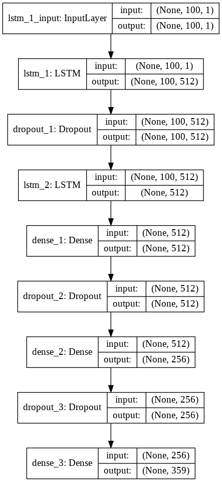

    
<h1>AI Music Generator</h1>

This is a Deep Learning & Natural Language Processing model which can generate Piano Music

<h3> TABLE OF CONTENTS </h3>
<ol type="I">
    <li><a href="#intro"> Introduction </a></li>
    <li><a href="#dataset"> Dataset </a></li>
    <li><a href="#musicology"> Music Theory </a></li>
    <li><a href="#model"> Model </a></li>
    <li><a href="#frameworks"> Frameworks, Libraries & Languages </a></li>
    <li><a href="#usage"> Usage </a></li>
    <li><a href="#acknowledgement"> Acknowledgement </a></li>
</ol>

<h2 id="intro">Introduction</h2>

Over time, the use of neural networks has grown gradually. Deep Learning has found applications in many domains of our everyday life, ranging from recommendation systems and customization to medical diagnostics and healthcare, with a plethora of papers produced each year. The use of these strategies for content production has lately gained popularity.
 
A similar principle may be used to train a neural network to make music, which has been popular in recent years. To produce piano music, I built a Long-Short Term Memory (LSTM) neural network in Python using Keras and Tensorflow.

<h2 id="musicology"> Music Theory </h2>

Music is defined as "the art of mixing vocal or instrumental sounds (or both) to achieve beauty of form, harmony, and expression of emotion" by the Concise Oxford Dictionary. To put it simply, music is made up of one basic ingredient - the note. A note is simply the pitch of the music at that moment in time. Notes are a discretization of musical occurrences and are sometimes considered as the foundation of music.
 
Although pitch may be broadly understood to be connected with sound frequency, it is really more of an abstract quality that depends on the listener's perspective. It is frequently represented by capital letters: A, B, C, D, E, F, G. These letter names can also be changed by employing two accidentals: # (the shap symbol, which increases a note by one half-step) and (the flat sign, which lowers it by half-step).Each Note also has certain other characteristics namely - Offset (the length of time from the start of a piece when the note is played) and Duration (the time for which the note is held). If there are no periods of silence in the music and no occurrences of two notes being played together, then the offset of a note is effectively the sum of the previous durations.
 
In music, a chord is a group of numerous notes ("pitches") that sound at the same time. A piano often has multiple spans (or sets) of eight-white keys known as an Octave.

<h2 id="model">Model</h2>
    

    <figure>
        
        <figcaption> A plot of the model and its layers </figcaption>
    </figure>
    

    

    Using the Keras Sequential API, we created an LSTM model that takes in fixed-length sequences of notes and learns to predict the next note in the series. Above is a visualisation of the model layers.
    

    
<h2 id="frameworks">Frameworks, Libraries & Languages</h2>
<ul>
    <li> Keras </li>
    <li> Tensorflow </li>
    <li> Numpy </li>
    <li> Python3 </li>
    <li> timidity </li>
    <li> pickle-mixin </li>
    <li> glob </li>
    <li> music21 </li>
</ul>
    
<h2 id="usage">Usage</h2>
<ol>
    <li>
        Install all dependencies
         
        <code> pip install python3 </code>
         
        <code> pip install numpy </code>
         
        <code> pip install tensorflow </code>
         
        <code> pip install keras </code>
         
        <code> pip install timidity </code>
         
        <code> pip install pickle-mixin </code>
         
        <code> pip install music21 </code>
    </li>
    <li>
        Clone the repository to your system and head over to it  
        <code> git clone https://github.com/athy125/musicgen_proj</code>  
        <code> cd AI_Music_Generator </code>
    </li>
    <li>
        To listen to a music file -  
        <code> cd songs </code>  
        <code> timidity [filename] </code>  
        Replace [filename] with complete name of file you wish to listen
    </li>
    <li>
        To generate piano music from a random sequence from the songs/ directory  
        <code> python3 generate.py </code>  
        This will create a MIDI music file named "output.midi" in the same directory. To listen to this, type  
        <code> timidity output.midi </code>
           
        This step can be repeated any number of times, and at each iteration a random music file will be generated
    </li>
</ol>

